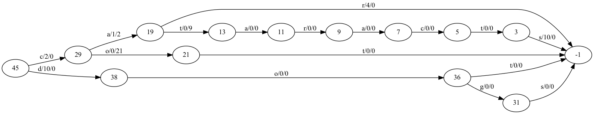

The compilation operation deduplicates nodes before writing them into the byte array fst. This means that 
two nodes will not for the same inputs generate the same outputs. 


## Example

```ocaml
  ["ca" 5; "car", 7; "cat", 12; "cataract", 3;
  "cataracts", 13; "co", 23; "cot", 2; "dog", 10;
  "dogs", 10; "dot", 10]
```



## Types

compiled_state is an int pointer to the location of the compiled state in the byte array 

uncompiled_state

```ocaml
{
   transitions: [
     {
        ch: char;
        output: output;
        target: (output, compiled_state)       
     }
   ];
   final_output: output option;  
}
```

arc

```ocaml
{
  target: int;
  label: int;
  output: Output.t;
  final_output: Output.t;
}
```

## Compiling an uncompiled state

### Variables
* node_hashes: (arc list, int) Hashtbl.t - A hash table where the key is a list of arcs and the value is the
  position of the the node the list compiles into.
* uncompiled_state: (output, (output, compiled_state)) State.t

### Algorithm

* Convert the uncompiled state into a list of arcs
* If the arc is not a key in the hash table
   * Write the list of arcs as a new node in the byte array fst
   * Add the list of arcs and the new node's position into the hash table
* Get the node position for the list of arcs from the hash table

## An alternate approach

This approach adds some complexity for some space savings. It avoids the need to store entire arc lists as keys.

### Variables

 * node_hashes: (int, uncompiled_state list) Hashtbl.t - A hash table where the key is a hash of the arcs in a node and
   the value is a list of pointers to nodes that generate that hash.
 * uncompiled_state: (output, (output, compiled_state)) State.t

### Functions

```ocaml
val are_equal_states: byte_array_fst_reader -> compiled_state -> uncompiled_state -> bool
```

```ocaml
val uncompiled_state_hash: uncompiled_state -> int
```

### Algorithm

 * Find the hash of the uncompiled state.
 * Use the has to look up a list of uncompiled lists from node hashes defaulting to an empty list.
 * Find the compiled state that is equal to the uncompiled state.
 * If none is found create a new compiled state 
   * Add the new compiled state to node hashes
   * Return the new compiled steate
 * If a compiled state is found return it.

