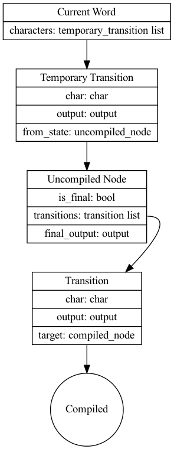

The acyclic transducer construction described in https://citeseerx.ist.psu.edu/viewdoc/summary?doi=10.1.1.24.3698 forms
the basis of the FST used in Lucene to search for terms in the index.

The fst described by the paper adds a lot of stateful update operations that make alternate implementations of the fst 
tricky. This document describes a simpler version of the algorithm.

# Algorithm

## Types



## Initial state
 * current_word - The first word in the input list represented as a list of temporary state transitions
 * next_word - A list of chars representing the next word
 * next_output - An output representing the output for the next word
 
## Example

If the first word is "cat" -> "bar"

current word will be

```ocaml
 [
   {output = "bar"; char = 'c'; from_state = { is_final = false; transitions = []; final_output = ""} }
   {output = ""; char = 'a'; from_state = { is_final = false; transitions = []; final_output = ""} }
   {output = ""; char = 't'; from_state = { is_final = false; transitions = []; final_output = ""} }
 ]
```

If the next word is "cab" -> "bat"

```ocaml
 [
   {output = "ba"; char = 'c'; from_state = { is_final = false; transitions = []; final_output = ""} }
   {output = ""; char = 'a'; from_state = { is_final = false; transitions = []; final_output = ""} }
   {output = "t"; char = 'b'; from_state = { is_final = false; transitions = [{char = 't'; output = "r", target = compiled_node}]; final_output = ""} }
]
```

### Split the current word 

Split the list into two parts common_prefix and compilation_candidates.

In the example, the common_prefix would be the list containing char = 'c' and char = 'a'. Compilation candidates 
would be list containing char = 't'.

### Push the outputs up the common prefix

This can be represented as a left fold

Initial value will be the next output and an empty list. The list will accumulate the updated temporary state 
transitions in a reverse order. 

```ocaml
val push_output:  (output * temporary_state_transition list) -> temporary_state_transition -> (output * temporary_state_transition list)
```

For each temporary state transition
 * Update the transition's output to the common prefix
 * Push the suffix of the original output to from_state's transtion outputs and the final output
 * Return the suffix of the input output and append the updated transition to the input list

### Compile the suffix

compilation_candidates

### Append the compiled suffix

### Extend the current word 
