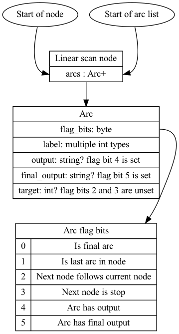

# The implementation of the FST.

The FST is represented in terms of the arcs or transitions between state nodes. Some states in the fst can be final states, these match to a prefix which points to a block in a dictionary

E.g. We have a simple fst a -> b -> c where b is a final state, the output of the transducer at that point will be a valid path to a block. The output for non final states will always be empty.

It starts with a virtual arc that points to the first state. The first state is a final state as the empty string can be considered a match. The transducer in this case returns an empty output.

States do not have labels, instead the incoming arc contains a pointer to the next state's data.

Transition labels are the individual bytes in the term string.

To transition based on a label. The first step is to change the position on the FST's input to the position of the state's data.

A byte is read to get the representation of outgoing arcs.

There are three representations

1. Direct Addressing
2. Binary Search
3. Linear Scan

## Direct Addressing

With direct addressing it is possible to jump straight to the arc that matches the next label.

A bitset is used to speed up the lookup, if a label is not present in the bitset it won't be a valid arc.

The structure of a direct addressing node is as follows

* num_arcs: vint
* bytes_per_arc: vint
* presence_bit_table: byte[(num_arcs + 7) lsl 3]
* first_label: byte
* arc_list: bytes_per_arc * `number of arcs with set bits`

The presence bit table acts as a space optimization measure. If the bit indexed by the label is set. The count of set bits upto that bit gives the index of the arc. The bit index can be calculated as label - first_label.

Each arc has the following structure
A flag byte containing the following bits

* bit_arc_has_output: Arc has output
* Arc has final output
* Next node is stop node
* This arc is the final arc
* bit_target_next: The next target state immediately follows the current node
* This is the last arc in the list

If bit_arc_has_output is set read the output bytes as a string
If bit_arc_has_final_output is set read final output bytes as a string

If the bit_target_next flag is set simply jump to the next node by jumping to the end of the current one.
Otherwise read the position from arc data as a vint.

## Linear Scan

To find an arc in a linear scan node requires visiting each arc. The linear scan arcs do not require padding and takes less space than the direct addressing arcs. 

The linear scan node only contains arcs. The lack of direct addressing in the flag bytes signals that the byte is the flag byte of the first arc.

