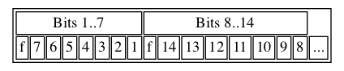

# Reading and writing data from a file

## vint
vints are a variable length serializaiont of ints. The number of bytes required depends on its bit width. 

A 7 bit number will take a single byte with the 8th bit as a flag for whether another byte is required. 

An 8 bit number will require 2 bytes, the first byte will contain the first 7 bits and the flag bit set to 1 and the second byte will contain a single bit and the flag bit set to 0.

