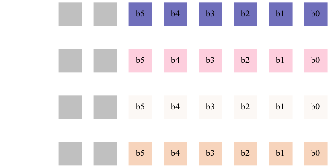
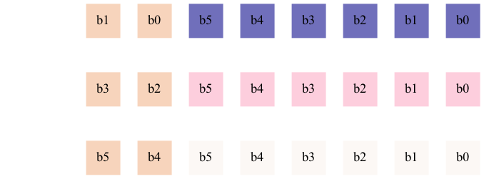

# Table of Contents

1.  [Compression ranges](#org07688e6)
    1.  [[0x1F,0x3F)](#orgbb9482a)
    2.  [[0x5F,0x7F)](#org3e5b263)
2.  [Compressing a string](#org11a94ef)
    1.  [Shrink the byte to 6 bits](#org164826a)
    2.  [Pack the extra bits](#org0ba2cfd)
    3.  [Handle exceptional cases](#org136f6e0)
        1.  [Count the number of exception](#orgbe7508d)
        2.  [Write the exception location and value](#org223cddd)
    4.  [Put it all together](#orgfbe29a1)
3.  [Decompressing a compressed string](#org130dc56)
    1.  [Create a byte array to uncompress into](#org2352804)
    2.  [Copy the packed bytes into the byte array](#org6b161c7)
    3.  [Unpack bits to their original positions](#org02ea990)
    4.  [Convert each six bit value to its value in the original range](#org87765a9)
    5.  [Put any exceptions back into the byte array](#orge2cd78e)
    6.  [Put it all together](#orgc608a89)

This compression scheme can be used shrink byte strings that predominantly contain
lowercase ascii characters and digits.

    let input_string = "This is a simple compressible string. It contains a number of capitalized letters."

# Compression ranges

Compression occurs for elements in two 32 element ranges [0x1F,0x3F) and [0x5F,0x7F)

## [0x1F,0x3F)

Contains the characters

    Line 3, characters 22-24:
    3 | |> String.concat ~sep:"";;
                              ^^
    Error: The function applied to this argument has type
             string -> string list -> string
    This argument cannot be applied with label ~sep

## [0x5F,0x7F)

Contains the characters

    Line 3, characters 22-24:
    3 | |> String.concat ~sep:"";;
                              ^^
    Error: The function applied to this argument has type
             string -> string list -> string
    This argument cannot be applied with label ~sep

# Compressing a string

## Shrink the byte to 6 bits

When a byte is present in the two ranges it can be compressed into 6bits. The higher order bit acts as a flag
marking which range the byte belongs to. When the bit is set the bits are from the range [0x5F,0x7F)

    let shrink_char byte =
      let b = byte + 1 in
      (b land 0x1F) lor (b land 0x40) lsr 1

    Lines 4-13, characters 6-3:
     4 | ......x ->
     5 |   [
     6 |     Printf.sprintf "%c" (char_of_int x);
     7 |     Printf.sprintf "0x%0X" x;
     8 |     int_to_bits_string x;
     9 |     int_to_bits_string (x+1);
    10 |     int_to_bits_string ((0x40 land (x+1)) lsr 1);
    11 |     int_to_bits_string (0x1F land (x+1));
    12 |     int_to_bits_string ( ((0x40 land (x+1)) lsr 1) lor  (0x1F land (x+1)) )
    13 |   ]....
    Error: The function applied to this argument has type
             ('a -> 'b) -> 'a list -> 'b list
    This argument cannot be applied with label ~f

Before shrinking 'a' will be

    Line 1, characters 19-37:
    1 | int_of_char 'a' |> int_to_bits_string;;
                           ^^^^^^^^^^^^^^^^^^
    Error: Unbound value int_to_bits_string

After shrinking 'a' will be

    Line 1, characters 33-51:
    1 | shrink_char (int_of_char 'a') |> int_to_bits_string;;
                                         ^^^^^^^^^^^^^^^^^^
    Error: Unbound value int_to_bits_string

Shrinking will also apply to out of range characters, so 'A' shrinks to.

    Line 1, characters 33-51:
    1 | shrink_char (int_of_char 'A') |> int_to_bits_string;;
                                         ^^^^^^^^^^^^^^^^^^
    Error: Unbound value int_to_bits_string

The value will be present in the final compressed array but will be replaced by a valid byte from an
exceptions list.

    let shrink s =
      String.map ~f:(fun c -> (char_of_int (shrink_char (int_of_char c)))) s

Shrink the input string

    let shrunk_string = shrink input_string

    Line 1, characters 20-26:
    1 | let shrunk_string = shrink input_string;;
                            ^^^^^^
    Error: Unbound value shrink

## Pack the extra bits

Four six bit values can fit into three bytes.

Supose the input string length is divisible by four. A fourth of the bytes can
to packed into the 2 bits available in the other three fourths bytes.

After packing the bits from the fourth byte are copied into each of the other three bytes
filling up their gray bits. b0 and b1 are copied into the first byte, b2 and b3 into the second
and b4 and b5 into the third.

    let pack buf s = begin
      let len = String.length s in
      let packable_bytes_length = len / 4 in
      let packable_bytes_start = len - packable_bytes_length in
      for i = 0 to packable_bytes_length * 3 - 1 do
        let shift_index = i mod packable_bytes_length in
        let packable_bits_index = packable_bytes_start + shift_index in
        let packable_bits_char = String.get s packable_bits_index in
        let packable_bits = int_of_char packable_bits_char lsr (4 - i/packable_bytes_length * 2) land 3 in
        let shrunk_char = String.get s i |> int_of_char in
        let updated_char = shrunk_char + (packable_bits lsl 6) in
        Buffer.add_char buf (char_of_int updated_char)
      done;
      for i = packable_bytes_length * 3 to packable_bytes_start - 1 do
        Buffer.add_char buf (String.get s i)
      done
    
    end

    let s = "\x3F\x2a\x15\x39";;
    let buf = Buffer.create 0;;
    pack buf s;;
    let packed = Buffer.contents buf;;
    begin
      Printf.printf "Size after packing: %d\n" (String.length packed);
      Printf.printf "Packed bytes:\n";
      String.iter packed ~f:(fun c -> Printf.printf "%s\n" (int_to_bits_string (int_of_char c)))
    end

## Handle exceptional cases

The distance in bytes from one exceptional character to the next is stored as a byte.
If the distance is more that 256 bytes, the 256th byte is treated as an exception.

    let is_compressable c =
      (0x1F < c && c <= 0x3F) || (0x5F < c && c <= 0x7F)

### Count the number of exception

    let exception_count s =
      let rec loop i j count =
        if i = String.length s then
          count
        else if not (is_compressable (int_of_char (String.get s i))) then
          loop (i + 1) 1 (count + (j / 0xFF) + 1)
        else
          loop (i + 1) (j + 1) count in
      loop 0 0 0

    exception_count input_string

The following string contains two exceptions

    let short_string = "This is a Short strings?";;
    let short_string_exception_count = exception_count short_string

    Line 1, characters 35-50:
    1 | let short_string_exception_count = exception_count short_string;;
                                           ^^^^^^^^^^^^^^^
    Error: Unbound value exception_count

This longer string contains 9 exceptions

    let buf = Buffer.create 0;;
    for i = 1 to 2000 do
      if i mod 521 = 0 then
       Buffer.add_char buf 'T'
      else
       Buffer.add_char buf 't'
    done;;
    let long_string = Buffer.contents buf;;
    let long_string_exception_count = exception_count long_string

    Line 1, characters 34-49:
    1 | let long_string_exception_count = exception_count long_string;;
                                          ^^^^^^^^^^^^^^^
    Error: Unbound value exception_count

### Write the exception location and value

    let exceptions buf s =
      let rec loop i j =
        if i < String.length s then
          let c = int_of_char (String.get s i) in
          if j = 255 || not (is_compressable c) then begin
            Buffer.add_char buf (char_of_int j);
            Buffer.add_char buf (char_of_int c);
            loop (i + 1) 1
            end
          else
            loop (i + 1) (j + 1) in
      loop 0 0

The exceptions for the short string

The exceptions for the long string

## Put it all together

    let compress s =
      let shrunk = shrink s in
      let exc = exception_count s in
      let buf = Buffer.create 0 in
      pack buf shrunk;
      Buffer.add_char buf (char_of_int exc);
      exceptions buf s;
      Buffer.contents buf

    let compressed = compress input_string;;

# Decompressing a compressed string

## Create a byte array to uncompress into

    let len = String.length input_string;;
    let packed_bytes_length = len / 4;;
    let packed_bytes_start = len - packed_bytes_length;;
    let uncompressed_length = String.length input_string;;
    let bytes = Bytes.create uncompressed_length

## Copy the packed bytes into the byte array

    Bytes.From_string.blito ~src:compressed ~src_len:packed_bytes_start ~dst:bytes ();;

## Unpack bits to their original positions

    for i = 0 to packed_bytes_length - 1 do
      let c1 = Bytes.get bytes i |> int_of_char in
      let c2 = Bytes.get bytes (packed_bytes_length + i) |> int_of_char in
      let c3 = Bytes.get bytes (2 * packed_bytes_length + i) |> int_of_char in
      let c = (c3 lsr 6) lor ((c2 land 0xC0) lsr 4) lor ((c1 land 0xC0) lsr 2) in
      Bytes.set bytes (packed_bytes_start + i) (char_of_int c)
    done

## Convert each six bit value to its value in the original range

    let unshrink_char b =
      (((b land 0x20) lsl 1) lor 0x20 lor (b land 0x1F)) - 1

    Lines 4-12, characters 20-8:
     4 | ....................x ->
     5 |        [
     6 |          int_to_bits_string x;
     7 |          int_to_bits_string ((x land 0x20) lsl 1);
     8 |          int_to_bits_string (x land 0x1F);
     9 |          int_to_bits_string (((x land 0x20) lsl 1) lor 0x20 lor (x land 0x1F));
    10 |          int_to_bits_string (unshrink_char x);
    11 |          Printf.sprintf "%c" (unshrink_char x |> char_of_int)
    12 |        ]...
    Error: The function applied to this argument has type
             ('a -> 'b) -> 'a list -> 'b list
    This argument cannot be applied with label ~f

    for i = 0 to (Bytes.length bytes - 1) do
      Bytes.set bytes i (unshrink_char (Bytes.get bytes i |> int_of_char) |> char_of_int)
    done

## Put any exceptions back into the byte array

    let idx = ref packed_bytes_start;;
    let read_byte () =
      let c = String.get compressed (!idx) in
      idx := !idx + 1;
      c;;
    let len = read_byte () |> int_of_char;;
    if len > 0 then
      let prev_exception = ref 0 in
      for _ = 1 to len do
        let i = read_byte () |> int_of_char in
        prev_exception := !prev_exception + i;
        let b = read_byte () in
        Bytes.set bytes !prev_exception b
      done

    bytes

    Line 1, characters 0-5:
    1 | bytes;;
        ^^^^^
    Error: Unbound value bytes

## Put it all together

    let uncompress uncompressed_length s =
      let packed_bytes_length = uncompressed_length / 4 in
      let packed_bytes_start = uncompressed_length - packed_bytes_length in
      let bytes = Bytes.create uncompressed_length in
      Bytes.From_string.blito ~src:compressed ~src_len:packed_bytes_start ~dst:bytes ();
      for i = 0 to packed_bytes_length - 1 do
        let c1 = Bytes.get bytes i |> int_of_char in
        let c2 = Bytes.get bytes (packed_bytes_length + i) |> int_of_char in
        let c3 = Bytes.get bytes (2 * packed_bytes_length + i) |> int_of_char in
        let c = (c3 lsr 6) lor ((c2 land 0xC0) lsr 4) lor ((c1 land 0xC0) lsr 2) in
        Bytes.set bytes (packed_bytes_start + i) (char_of_int c)
      done;
      for i = 0 to (Bytes.length bytes - 1) do
        Bytes.set bytes i (unshrink_char (Bytes.get bytes i |> int_of_char) |> char_of_int)
      done;
      let idx = ref packed_bytes_start in
      let read_byte () =
        let c = String.get compressed (!idx) in
        idx := !idx + 1;
        c in
      let len = read_byte () |> int_of_char in
      if len > 0 then begin
          let prev_exception = ref 0 in
          for _ = 1 to len do
            let i = read_byte () |> int_of_char in
            prev_exception := !prev_exception + i;
            let b = read_byte () in
            Bytes.set bytes !prev_exception b
          done
        end;
      Bytes.to_string bytes

    uncompress (String.length input_string) compressed

    Line 1, characters 0-10:
    1 | uncompress (String.length input_string) compressed;;
        ^^^^^^^^^^
    Error: Unbound value uncompress

