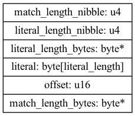
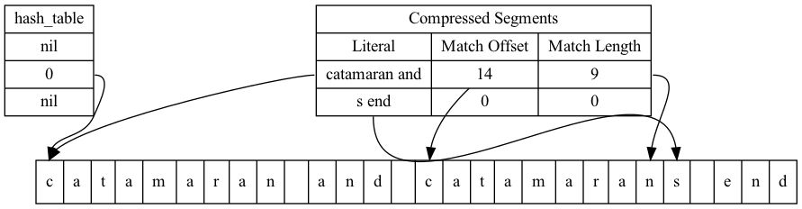

# Table of Contents

1.  [The LZ4 block format](#org0e8eb45)
2.  [Compression](#orga28887a)
3.  [End of compression](#org1e5a7e1)
    1.  [Strings shorter than 11 bytes long cannot be compressed](#orgb9e1989)
    2.  [Short strings will be represented by a single final sequence](#org29432b3)

# The LZ4 block format

[LZ4 Block Format Description](https://github.com/lz4/lz4/blob/dev/doc/lz4_Block_format.md).

An lz4 compressed **block** contains multiple **sequences**. Each **sequence** can contain two parts. A literal string which can be copied into the output. And a **match** which points to a substring in the uncompressed output.

A sequence starts with a **token** byte that contains two 4 bit nibbles.  The lower bits contain the literal's length. Literals of lengths 14 bytes and less can be represented by the nibble. Longer lengths require additional length bytes.

    let rec read_length_bytes data =
      let b = Reader.read_byte data in
      if b < 255 then
        b
      else
        b + read_length_bytes data
    
    let read_length length_nibble data =
      if length_nibble < 15 then
        length_nibble
      else
        length_nibble + read_length_bytes data

If the value of the length nibble is less than 15 no extra bytes are required.

    read_length 14 (Reader.of_string "")

    14

If the length nibble is 15 an extra byte will be read and added to the total length.

    read_length 15 (Reader.of_string "\x00")

    15

If the byte read is 255 then 255 is added to the total length and an extra byte is read.

    read_length 15 (Reader.of_string "\xFF\x03")

    273

Once the length of the lteral is calculated the bytes can be copied from the sequence and appended onto the uncompressed buffer.

    let copy_literal data length buffer =
      let bytes = Reader.read_n_bytes data length in
      Buffer.add_string buffer bytes

    let buffer = Buffer.create 0;;
    let data = Reader.of_string "copied literal";;
    copy_literal data 14 buffer;;
    Buffer.contents buffer

    copied literal

The second part of the sequence is the match. The match copies bytes from the uncompressed buffer and appends them to the bufffer. The bytes are copied from an offest up to 65535 bytes before the current end of the buffer.

The match length is calculated in a similar manner to the literal length, using extra match lenght bytes if required. 4 bytes need to be added to the match length. This is beccause a match will be at least 4 bytes long.

    let copy_match match_length_nibble data buffer =
      let offset = Reader.read_u16_le data in
      let match_length = read_length match_length_nibble data + 4in
      let matched = Buffer.sub buffer ~pos:(Buffer.length buffer - offset) ~len:match_length |> Bytes.to_string in
      Buffer.add_string buffer matched

    let buffer = Buffer.create 0;;
    Buffer.add_string buffer "copied match bytes ";;
    let data = Reader.of_string "\x13\x00\x03";;
    copy_match 15 data buffer;;
    Buffer.contents buffer

    copied match bytes copied match bytes

# Compression

Compression works by finding matching substrings. A hashtable can speed up the search of substrings.

In the example the entry in the hash table for the string "cata" points to index 0. The literal "catamaran and " is copied into the first sequence, The prefix "cata" is found in the hash and the string "catamaran" matches the string at index 0. It is used t construct the hash. "s end" is a five character literal that marks the end of the block. 

# End of compression

The last sequence of the block will only contain a literal. The last literal will be at least 5 bytes long.

This means a few things

## Strings shorter than 11 bytes long cannot be compressed

The smallest compressed block will contain two sequences. The first sequence will have a 4 byte literal. The block will be of length token size + 4 + token size + 5 = 1 + 4 + 1 + 5 = 11.

## Short strings will be represented by a single final sequence

