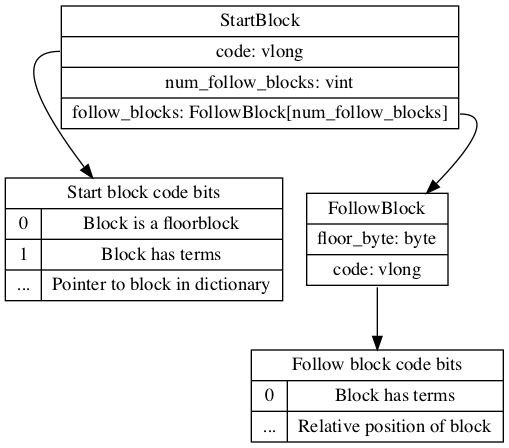

The terms index is split into two files an index and a dictionary

# The index FST

The index is an FST(Finite State Transducer). It works similar to a prefix tree where it points to the location of the terms with the same prefix the dictionary.

More details can be found in [the index fst](index_fst.md)

Given a prefix the fst will return a pointer to the data in the dictionary as a byte array.

## Structure of the pointer data



The pointer data is a byte array that can be read as a data input.

Read a vlong code. The lowest two bytes are bit flags. The code can be right shifted to get a pointer in the dictionary file to the starting block to search for the term. 

The bit flags are

* bit_has_terms: The block has term data.
* bit_is_floor: Is a floor block

The remaining bits make up the pointer to the blocks that may contain the matching suffix in the dictionary file.


Under some circumstances the blocks may be broken up into ranges of blocks. In this case is_floor will be true.

Example
```
 - pointer to the first block of the first ranges
 - Floor character eg 'c', if the first character is smaller than 'c' use the first pointer
 - pointer to the first block that contains a suffix starting with 'c'
 - ...
```

### The algorithm

 * Get the number of follow blocks
 * Get the next prefix character
 * If the first character of the suffix is less than the next prefix character
   * Return the previously found pointer allong with the has terms flag
 * Get whether the next block has terms and the amount to increase the pointer by,
 * Update the pointer
 * If this the last range are more than 1 ranges left
   * Return the ponter and has terms
 * Repeat from getting the next prefix character

# Finding terms in the terms dictionary

Thf block pointer gives the position of the block containing the data in dictionary.

