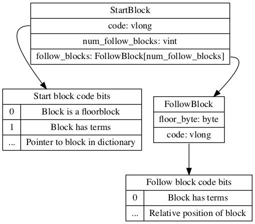

The terms index is split into two files an index and a dictionary

# The index FST

The index is an FST(Finite State Transducer). It works similar to a prefix tree where it points to the location of the terms with the same prefix the dictionary.

More details can be found in [the index fst](index_fst.md)

Given a prefix the fst will return a pointer to the data in the dictionary as a byte array.

### Structure of the pointer data

The pointer data is a byte array that can be read as a data input.

Read a vlong code. The lowest two bytes are bit flags. The code can be right shifted to get a pointer in the dictionary file to the starting block to search for the term. 

The bit flags are

* bit_has_terms: The block has term data.
* bit_is_floor: Is a floor block

Question: What is a floor block.

The next step is to read the next floor label byte. This gives the upperbound of labels found in the current block.

If the bit_has_terms is false, the labels lower than the next floor label will not map to any terms.

If the target label is greater than the next floor label read the next block.

# Finding terms in the terms dictionary

Thf block pointer gives the position of the block containing the data in dictionary.

